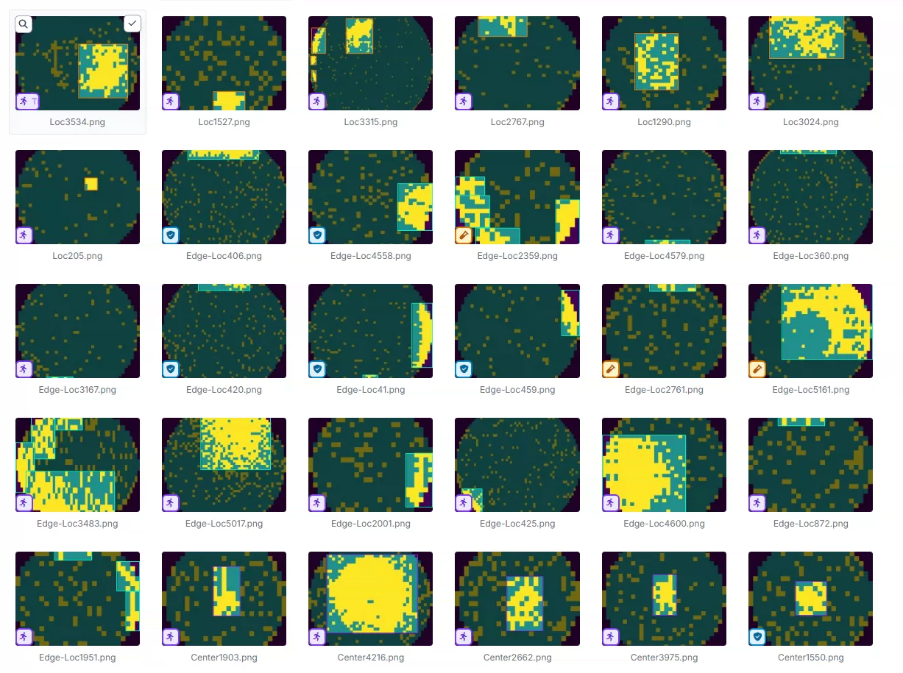
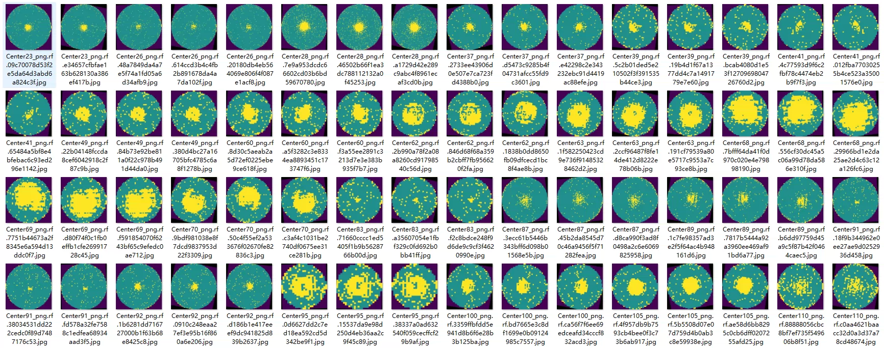
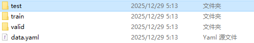
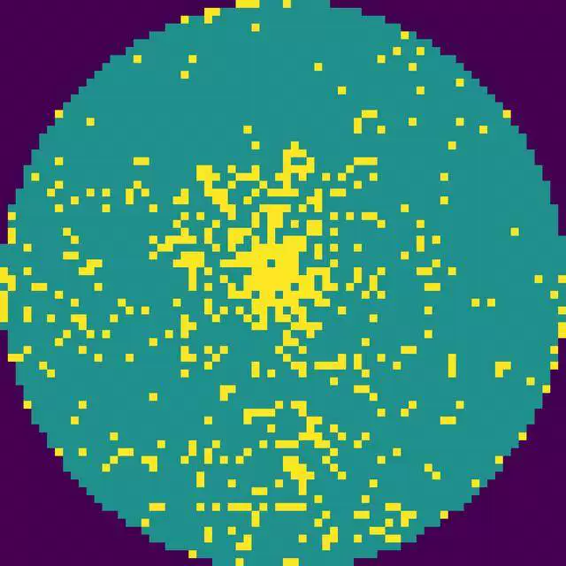
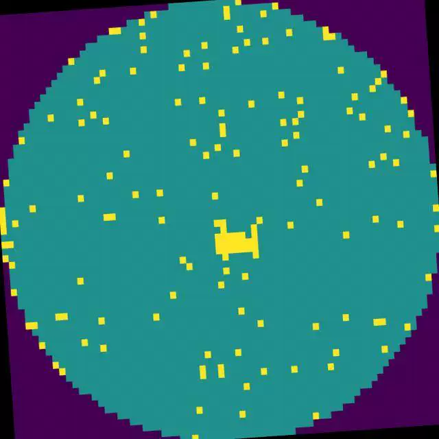
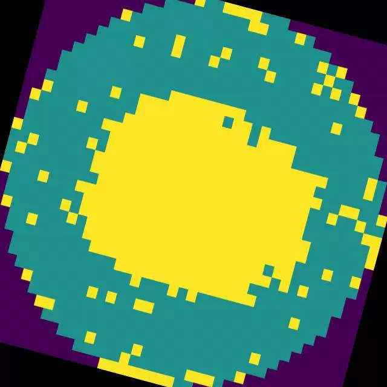
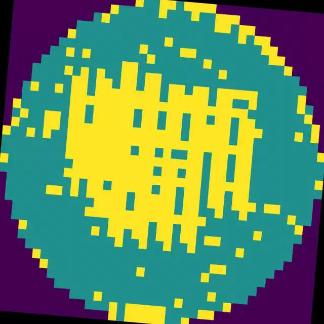

## Body

The defect detection dataset for semiconductor wafers is in YOLO format.

Totally 18,000+ images are available, all labeled properly.
It's divided into 8 categories: 'Center', 'Donut', 'Edge-Loc', 'Edge-Ring', 'Loc', 'Near-full', 'Random', 'Scratch'
'Center', 'Donut', 'Edge-Loc', 'Edge-Ring', 'Loc', 'Near-full', 'Random', 'Scratch'

Electronic virtual products sold are not returnable.

## Images

item_1036183271570

Here is a pay link on Stripe ( https://buy.stripe.com/3cs8yP7sY87d0vu9AB ). Please contact me lonlonago@foxmail.com after funding $89, and I will send you a complete data files , thank you!

